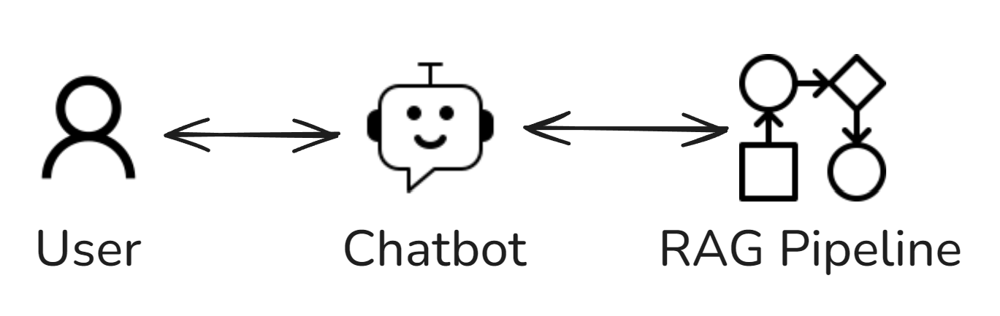
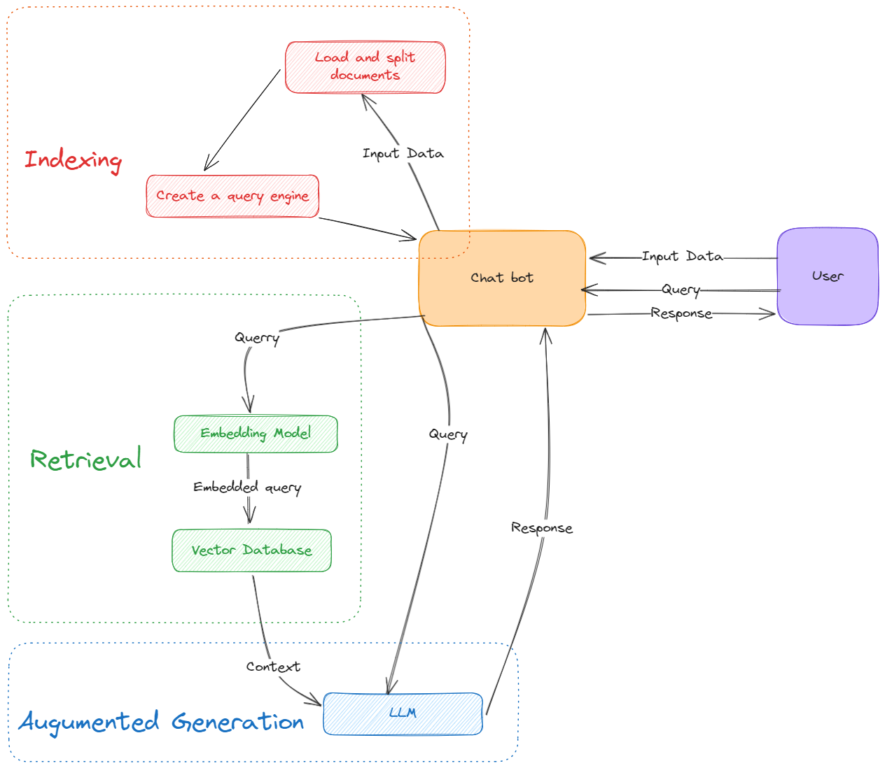
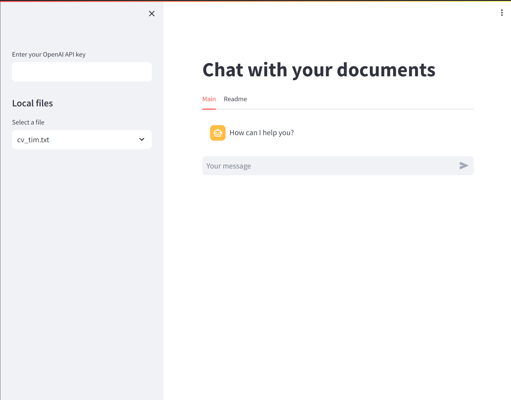

In this project, I develop a basic chatbot using the llama-index package and Streamlit. Check out the demo [here](https://chatdocumentllm.streamlit.app/).

My aim is to get hands-on experience with the llama-index package and to test the chatbot's functionality in a simple use case scenario: answering questions about a CV.

# Use Case
I've included a single CV document for simplicity. The chatbot is designed to respond to questions based on this CV. This setup allows me to evaluate both the chat functionality and the llama-index package efficiently.
Feel free to try out the demo and see how the chatbot handles questions about the provided CV.

Here's a brief overview drawing of the project:


# System Overview
The chatbot uses the llama index package to answer questions. The package is used to retrieve relevant documents from the llama index and then generate a response using the retrieved documents.
Here is a high-level overview of the system:


## Steps
The system goes through the following steps:
- **User add documents**
  -  The user adds their documents (.txt files) to data folder.
  -  The system show the user the documents added.

- **Indexing**
  - The system processes the uploaded documents and creates an index.

- **Query Engine Development**
  - The system develops a query engine, which is a component responsible for interpreting user queries and searching through the document index to retrieve relevant documents.

- **Query Processing**
  - a When the user asks a question, the chatbot utilizes the query engine to process the query.

## UI
The following screenshot shows the user interface of the application.


# Setup and Usage
It's recommended to create a virtual environment. Here, we'll be using Conda.
To create a new Conda environment, use the following command:

```bash
conda create --name llm
```

After creating the environment, activate it using:

```bash
conda activate llm
```

Once the Conda environment is activated, you can install the dependencies from the `requirements.txt` file. Use the following command:

```bash
pip install -r requirements.txt
```

To run the code, use the following command:

```bash
streamlit run main.py
```