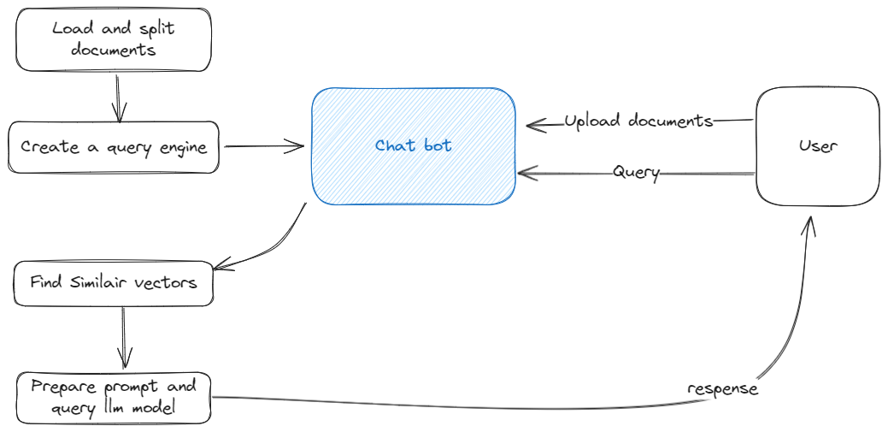

# Introduction
In this project, I develop a simple chatbot using llama index package and Streamlit. The used technique is RAG (Retrieval-Augmented Generation).

# Setting up a virtual environment
It's recommended to create a virtual environment. Here, we'll be using Conda.
To create a new Conda environment, use the following command:

```bash
conda create --name llm
```

After creating the environment, activate it using:

```bash
conda activate llm
```

Once the Conda environment is activated, you can install the dependencies from the `requirements.txt` file. Use the following command:

```bash
pip install -r requirements.txt
```

# Usage
To run the code, use the following command:

```bash
streamlit run main.py
```

# Use Case
The chatbot can be used to answer questions related to the llama index package. It can also be used to answer general questions about the package. To simplify the use case, I add one document which represent a cv of one person. The chatbot can answer questions about the cv.

# System overview
The chatbot uses the llama index package to answer questions. The package is used to retrieve relevant documents from the llama index and then generate a response using the retrieved documents.
Here is a high-level overview of the system:


## Steps
- **User Uploads Documents**: The user adds their documents (.txt files) to the system.

- **User Interaction**: The user can interact with the chatbot by asking questions or making queries.

- **Document Indexing**: The chatbot processes the uploaded documents and creates an index.

- **Query Engine Development**: The chatbot develops a query engine, which is a component responsible for interpreting user queries and searching through the document index to retrieve relevant documents.

- **Query Processing**: When the user asks a question or makes a query, the chatbot utilizes the query engine to process the query and retrieve relevant documents from the index.

Overall, this setup allows the chatbot to efficiently retrieve relevant information from the uploaded documents based on user queries.

